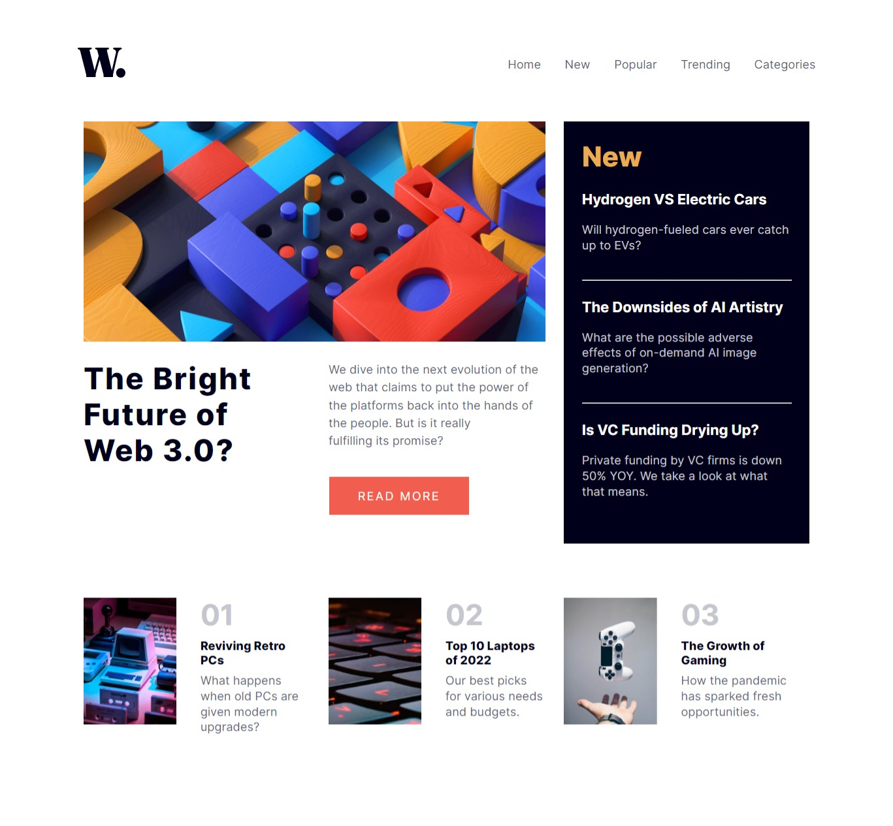

# Frontend Mentor - News homepage solution

This is a solution to the [News homepage challenge on Frontend Mentor](https://www.frontendmentor.io/challenges/news-homepage-H6SWTa1MFl). Frontend Mentor challenges help you improve your coding skills by building realistic projects. 

## Table of contents

  - [The challenge](#the-challenge)
  - [Screenshot](#screenshot)
  - [Links](#links)
  - [Built with](#built-with)
  - [What I learned](#what-i-learned)
  - [Continued development](#continued-development)
  - [Useful resources](#useful-resources)
  - [Author](#author)

### The challenge

Users should be able to:

- View the optimal layout for the interface depending on their device's screen size
- See hover and focus states for all interactive elements on the page
- **Bonus**: Toggle the mobile menu (requires some JavaScript)

### Screenshot




### Links

- Solution URL: [Add solution URL here](https://github.com/M1RAK/news-homepage-main)
- Live Site URL: [Add live site URL here](https://your-live-site-url.com)


### Built with

- Semantic HTML5 markup
- CSS custom properties
- Flexbox
- CSS Grid
- Vanilla Javascript

### What I learned
```js
const toggleMenu = () => {
  menuOpen.classList.toggle("active")
  menuClose.classList.toggle("active")
  mobileMenu.classList.toggle("active")
}
// Can be shortened by adding active to only one class && then adding Css for adjacent elements.
```

### Continued development
- Css Grid.

### Useful resources

- [Scrimba](https://www.scrimba.com) - This helped me learn css Grid. I really liked this pattern and will use it going forward.
<!-- 
## Author

- Website - [Add your name here](https://www.your-site.com)
- Frontend Mentor - [@yourusername](https://www.frontendmentor.io/profile/yourusername)
- Twitter - [@yourusername](https://www.twitter.com/yourusername) -->

